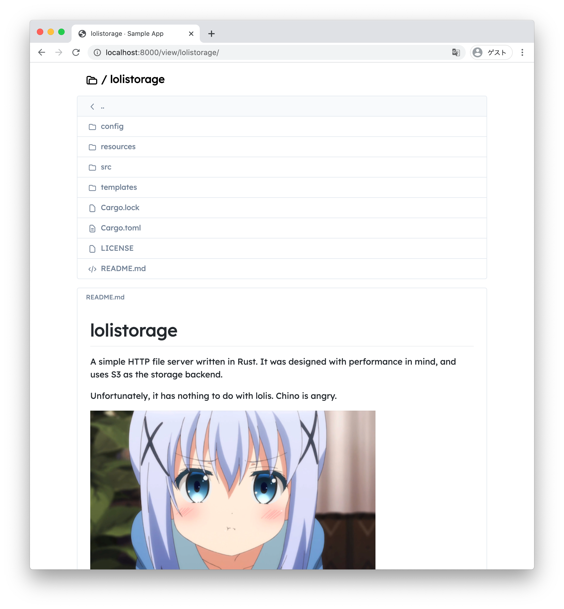

# lolistorage

A simple HTTP file server written in Rust. It was designed with performance in mind, and uses S3 as the storage backend.

Unfortunately, it has nothing to do with lolis. Chino is angry.

## Features

- Elegant and simple GitHub-like interface
- Can serve from any S3-compatible services
- Can handle large directories with pagination
- No client-side JavaScript, only server-generated HTML and CSS
- Supports index files (readme.md, index.html, etc.) with GitHub-flavored markdown rendering
- Supports range headers for video/audio streaming
- Provides a JSON endpoint for listing files and directories

